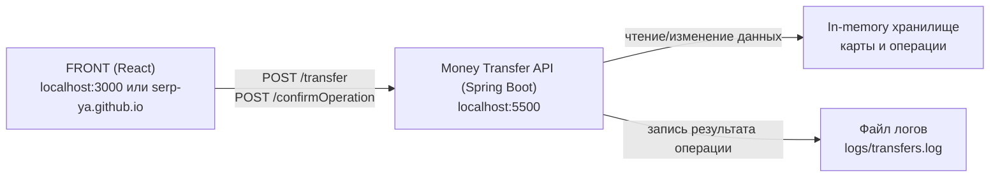

# Курсовой проект «Сервис перевода денег»

REST-сервис для перевода средств с карты на карту по спецификации Netology/OpenAPI.

## Что реализовано

- API-эндпоинты:
  - `POST /transfer` — создание операции перевода (статус `PENDING`)
  - `POST /confirmOperation` — подтверждение операции кодом
- Формат запросов/ответов соответствует спецификации:
  - успешный ответ: `{ "operationId": "..." }`
  - ошибки:
    - `400` — ошибки валидации/ввода (`{ "message": "...", "id": ... }`)
    - `500` — ошибки бизнес-операции (`{ "message": "...", "id": ... }`)
- Комиссия сервиса: `1%` от суммы перевода (минимум `1` в минорных единицах).
- Подтверждение операции: код `0000`.
- Логирование переводов в файл `logs/transfers.log`:
  - дата и время
  - карта списания и карта зачисления (в маскированном виде)
  - сумма
  - комиссия
  - результат (`PENDING`, `CONFIRMED`, `DECLINED: ...`)
- Юнит-тесты (Mockito) для сервисного слоя.
- Интеграционный тест (Testcontainers) для запуска сервиса в Docker-контейнере.
- Подготовлены `Dockerfile` и `docker-compose.yml`.

## Архитектура

- `controller` — REST-слой.
- `service` — бизнес-логика перевода и подтверждения.
- `repository` — in-memory хранилище карт и ожидающих подтверждения операций.
- `exception` — доменные ошибки и глобальный обработчик.
- `dto/model` — транспортные модели и доменные объекты.

### Схема приложений

```text
+---------------------------+
| FRONT (React, Browser)    |
| localhost:3000 или        |
| serp-ya.github.io         |
+------------+--------------+
             |
             | HTTP/JSON
             v
+---------------------------+
| Money Transfer API        |
| Spring Boot               |
| localhost:5500            |
+-----+----------------+----+
      |                |
      |                |
      v                v
+-----------+      +------------------+
| In-memory |      | Лог переводов    |
| cards/op  |      | logs/transfers.log|
+-----------+      +------------------+
```

Основные вызовы от FRONT:

- `POST /transfer` — создать операцию перевода (`PENDING`)
- `POST /confirmOperation` — подтвердить перевод кодом



Хранение данных о картах (демо-режим): в памяти приложения.
Предзагруженные карты:

- `1111222233334444` (`12/29`, `123`)
- `5555666677778888` (`11/28`, `456`)

## Локальный запуск

### 1) Через Gradle

```bash
./gradlew bootRun
```

Сервис поднимется на `http://localhost:5500`.

### 2) Через Docker

```bash
docker build -t money-transfer .
docker run -p 5500:5500 money-transfer
```

### 3) Через Docker Compose

По умолчанию запускается только API:

```bash
docker compose up --build
```

- API: `http://localhost:5500`

FRONT запускается опционально через профиль `front` (если рядом есть локальный репозиторий `../card-transfer`):

```bash
docker compose --profile front up --build
```

- API: `http://localhost:5500`
- FRONT: `http://localhost:3000`

## Примеры запросов

### Создание операции

```bash
curl -X POST http://localhost:5500/transfer \
  -H "Content-Type: application/json" \
  -d '{
    "cardFromNumber": "1111222233334444",
    "cardFromValidTill": "12/29",
    "cardFromCVV": "123",
    "cardToNumber": "5555666677778888",
    "amount": {
      "value": 10000,
      "currency": "RUR"
    }
  }'
```

### Подтверждение операции

```bash
curl -X POST http://localhost:5500/confirmOperation \
  -H "Content-Type: application/json" \
  -d '{
    "operationId": "<operationId>",
    "code": "0000"
  }'
```

## Тесты

Юнит-тесты:

```bash
./gradlew test --tests "*TransferServiceTest"
```

Интеграционный тест в контейнере (только при наличии Docker):

```bash
./gradlew test -DrunDockerIT=true --tests "*MoneyTransferContainerIT"
```

## Примечание по FRONT

Для демо-FRONT из задания CORS уже настроен для:

- `http://localhost:3000`
- `http://localhost:5500`
- `https://serp-ya.github.io`
